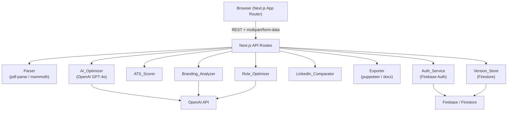
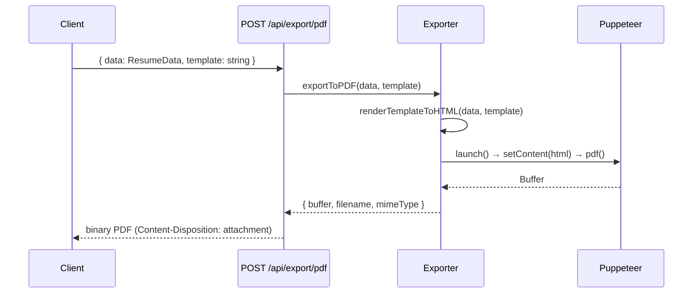

# Design Document: ResumeAI Pro

## Overview

ResumeAI Pro is a full-stack SaaS application built on Next.js 14 (App Router). The frontend delivers a glassmorphism UI with drag-and-drop upload, side-by-side comparison views, and an inline resume builder. The backend is implemented entirely via Next.js API routes, keeping the deployment surface minimal (single Vercel/Node.js process). OpenAI GPT-4o handles all AI tasks. Firebase Auth manages identity. Resume data is persisted in Firestore. File uploads are handled in-memory via Multer before being passed to the parsing pipeline.

The system is decomposed into eight domain services (Parser, AI_Optimizer, ATS_Scorer, Role_Optimizer, Branding_Analyzer, LinkedIn_Comparator, Resume_Builder, Exporter) plus two infrastructure services (Auth_Service, Version_Store). Each domain service is a pure TypeScript module with no framework coupling, making it independently testable.

---

## Architecture



### Key Architectural Decisions

- **No separate backend process**: All server logic lives in Next.js API routes. This avoids managing a separate Express/Fastify server and simplifies deployment.
- **Stateless API routes**: Each route receives all necessary data in the request body. Session state is validated via Firebase ID tokens on every protected route.
- **Pure domain modules**: Parser, ATS_Scorer, etc. are plain TypeScript modules imported by API routes. They have no Next.js dependency, making them trivially unit- and property-testable.
- **Firestore for persistence**: Schemaless document storage maps naturally to the Resume_Data JSON structure. Version history is stored as a sub-collection.
- **Puppeteer for PDF export**: Renders the same React template used in the builder to HTML, then prints to PDF, guaranteeing visual fidelity between preview and export.

---

## Components and Interfaces

### Parser

Responsible for extracting structured Resume_Data from uploaded files.

```typescript
interface ParseResult {
  data: ResumeData;
  unextractedFields: (keyof ResumeData)[];
}

function parseResume(buffer: Buffer, mimeType: "application/pdf" | "application/vnd.openxmlformats-officedocument.wordprocessingml.document"): Promise<ParseResult>
```

- PDF path: `pdf-parse(buffer)` → raw text → GPT-4o structured extraction prompt
- DOCX path: `mammoth.extractRawText({ buffer })` → raw text → same GPT-4o extraction prompt
- Returns partial Resume_Data with `null` for fields that could not be extracted

### AI_Optimizer

Communicates with OpenAI to rewrite resume content.

```typescript
interface OptimizationResult {
  data: ResumeData;
  error?: string;
}

function optimizeResume(data: ResumeData): Promise<OptimizationResult>
function optimizeSection(section: keyof ResumeData, content: unknown): Promise<unknown>
```

- Uses a system prompt that strictly forbids fabricating employers, titles, dates, or credentials
- On OpenAI error: returns original `data` unchanged plus `error` string

### ATS_Scorer

Pure computation — no external I/O.

```typescript
interface ATSBreakdown {
  keywordMatch: number;       // 0-30
  formattingReadability: number; // 0-20
  sectionCompleteness: number;   // 0-15
  impactMetrics: number;         // 0-15
  skillsRelevance: number;       // 0-10
  experienceDepth: number;       // 0-10
}

interface ATSResult {
  score: number;              // 0-100
  breakdown: ATSBreakdown;
  suggestions: string[];
  keywordMatchingSkipped: boolean;
}

function scoreResume(data: ResumeData, jobDescription?: string): ATSResult
```

- Deterministic: same inputs always produce same output
- When `jobDescription` is absent, `keywordMatch` is 0 and `keywordMatchingSkipped` is `true`
- Returns ≥3 suggestions when `score < 80`

### Role_Optimizer

```typescript
type SupportedRole = "Software Developer" | "UI/UX Designer" | "Product Manager" | "HR" | "Marketing";

interface RoleOptimizationResult {
  data: ResumeData;
  error?: string;
}

function optimizeForRole(data: ResumeData, role: SupportedRole): Promise<RoleOptimizationResult>
function validateRole(role: string): role is SupportedRole
```

- Calls AI_Optimizer with a role-specific system prompt
- `validateRole` returns false and the API route returns 400 for unsupported roles

### Branding_Analyzer

```typescript
interface BrandingResult {
  summaryScore: number;       // 1-10
  tone: "formal" | "technical" | "creative" | "neutral";
  hasUniqueValueProposition: boolean;
  uvpSuggestion?: string;
  headlines: string[];        // at least 1
  taglines: string[];         // at least 1
  careerNarratives: string[]; // at least 1
}

function analyzeBranding(data: ResumeData): Promise<BrandingResult>
```

### LinkedIn_Comparator

```typescript
interface LinkedInSource {
  type: "url" | "pdf";
  value: string | Buffer;
}

interface Inconsistency {
  field: string;
  resumeValue: string;
  linkedInValue: string;
  priority: "high" | "medium" | "low";
}

interface ComparisonResult {
  inconsistencies: Inconsistency[];
  resumeSuggestions: string[];
  linkedInSuggestions: string[];
}

function compareWithLinkedIn(data: ResumeData, source: LinkedInSource): Promise<ComparisonResult>
function importLinkedInFields(data: ResumeData, linkedInData: Partial<ResumeData>, selectedFields: (keyof ResumeData)[]): ResumeData
```

### Resume_Builder

Client-side React component tree. Communicates with API routes for section regeneration.

```typescript
interface BuilderProps {
  initialData: ResumeData;
  template: "notion" | "apple" | "ats-friendly";
  onSave: (data: ResumeData) => void;
}
```

- Inline editing updates local state via `useReducer`
- Template switch re-renders without touching data
- Section regeneration calls `POST /api/optimize/section`

### Exporter

```typescript
interface ExportResult {
  buffer: Buffer;
  filename: string;
  mimeType: string;
}

function exportToPDF(data: ResumeData, template: string): Promise<ExportResult>
function exportToDOCX(data: ResumeData): Promise<ExportResult>
```

- PDF: renders template to HTML string → Puppeteer `page.setContent()` → `page.pdf()`
- DOCX: constructs document using the `docx` library's Document/Paragraph/TextRun API

### Auth_Service

Thin wrapper around Firebase Admin SDK for server-side token verification.

```typescript
function verifyIdToken(idToken: string): Promise<DecodedIdToken>
function withAuth(handler: NextApiHandler): NextApiHandler  // middleware
```

### Version_Store

```typescript
interface ResumeVersion {
  versionId: string;
  resumeId: string;
  userId: string;
  data: ResumeData;
  timestamp: Date;
  versionNumber: number;
}

function saveVersion(userId: string, resumeId: string, data: ResumeData): Promise<ResumeVersion>
function listVersions(userId: string, resumeId: string): Promise<ResumeVersion[]>
function getVersion(userId: string, resumeId: string, versionId: string): Promise<ResumeVersion>
function deleteResume(userId: string, resumeId: string): Promise<void>
```

---

## Data Models

### ResumeData

The central data structure flowing through every component.

```typescript
interface PersonalInfo {
  name: string | null;
  email: string | null;
  phone: string | null;
  location: string | null;
  website: string | null;
  linkedin: string | null;
}

interface ExperienceEntry {
  company: string | null;
  title: string | null;
  startDate: string | null;  // ISO 8601 or "Present"
  endDate: string | null;
  location: string | null;
  bullets: string[];
}

interface EducationEntry {
  institution: string | null;
  degree: string | null;
  field: string | null;
  startDate: string | null;
  endDate: string | null;
  gpa: string | null;
}

interface ProjectEntry {
  name: string | null;
  description: string | null;
  technologies: string[];
  url: string | null;
}

interface ResumeData {
  resumeId: string;
  userId: string | null;
  personal_info: PersonalInfo;
  summary: string | null;
  skills: string[];
  experience: ExperienceEntry[];
  projects: ProjectEntry[];
  education: EducationEntry[];
  createdAt: string;   // ISO 8601
  updatedAt: string;   // ISO 8601
}
```

### Firestore Schema

```
/users/{userId}/
  /resumes/{resumeId}/
    - metadata: { name, createdAt, updatedAt, latestVersionNumber }
    /versions/{versionId}/
      - data: ResumeData
      - timestamp: Timestamp
      - versionNumber: number
```

---

## API Routes

| Method | Path | Auth | Description |
|--------|------|------|-------------|
| POST | `/api/upload` | required | Multipart upload; returns `ParseResult` |
| POST | `/api/optimize` | required | Full resume optimization |
| POST | `/api/optimize/section` | required | Single-section regeneration |
| POST | `/api/ats-score` | required | ATS scoring with optional job description |
| POST | `/api/role-optimize` | required | Role-based optimization |
| POST | `/api/branding` | required | Branding analysis |
| POST | `/api/linkedin/compare` | required | LinkedIn comparison |
| POST | `/api/linkedin/import` | required | Import selected LinkedIn fields |
| POST | `/api/export/pdf` | required | Export to PDF; returns binary |
| POST | `/api/export/docx` | required | Export to DOCX; returns binary |
| GET | `/api/resumes` | required | List user's resumes |
| POST | `/api/resumes` | required | Save new resume version |
| GET | `/api/resumes/[resumeId]/versions` | required | List versions |
| GET | `/api/resumes/[resumeId]/versions/[versionId]` | required | Load specific version |
| DELETE | `/api/resumes/[resumeId]` | required | Delete resume + all versions |

All protected routes use the `withAuth` middleware which validates the Firebase ID token from the `Authorization: Bearer <token>` header.

---

## Frontend Page and Component Structure

```
app/
  (auth)/
    login/page.tsx
    register/page.tsx
  dashboard/page.tsx          ← lists saved resumes
  builder/[resumeId]/page.tsx ← main builder view
  layout.tsx                  ← global providers (AuthContext, ThemeProvider)

components/
  upload/
    DropZone.tsx              ← drag-and-drop with glassmorphism styling
  builder/
    ResumeBuilder.tsx         ← orchestrator; holds ResumeData state
    TemplateSelector.tsx      ← Notion / Apple / ATS-friendly switcher
    SectionEditor.tsx         ← inline editable section wrapper
    templates/
      NotionTemplate.tsx
      AppleTemplate.tsx
      ATSFriendlyTemplate.tsx
  analysis/
    ATSScorePanel.tsx         ← score ring + breakdown + suggestions
    BrandingPanel.tsx         ← tone badge + UVP flag + suggestions
    LinkedInPanel.tsx         ← inconsistency list + import controls
  comparison/
    SideBySideView.tsx        ← original vs optimized diff view
  export/
    ExportMenu.tsx            ← PDF / DOCX download buttons
  auth/
    AuthGuard.tsx             ← redirects unauthenticated users
  ui/
    GlassCard.tsx             ← reusable glassmorphism card
    AnimatedSection.tsx       ← Framer Motion wrapper
```

---

## AI Prompt Engineering Patterns

### Extraction Prompt (Parser)

```
System: You are a resume parser. Extract structured data from the following resume text.
Return ONLY valid JSON matching this schema: { personal_info, summary, skills, experience, projects, education }.
Use null for any field you cannot find. Do not invent data.

User: <raw resume text>
```

### Optimization Prompt (AI_Optimizer)

```
System: You are an expert resume writer. Rewrite the provided resume data to:
1. Use strong action verbs (led, built, reduced, increased, etc.)
2. Improve grammar and clarity
3. Add quantified metrics where achievements lack measurable outcomes
CRITICAL: Do NOT change employer names, job titles, dates, or educational credentials.
Return ONLY valid JSON with the same schema as the input.

User: <ResumeData JSON>
```

### Role-Specific Prompt (Role_Optimizer)

```
System: You are a resume specialist for {role} positions.
Adjust the resume to emphasize keywords, skills ordering, structure, and tone
appropriate for {role} roles. Follow these conventions: {role_conventions}.
Return ONLY valid JSON with the same schema as the input.

User: <ResumeData JSON>
```

Role conventions are stored as static config per supported role (keyword lists, tone descriptors, section ordering preferences).

### Branding Prompt (Branding_Analyzer)

```
System: Analyze this resume for personal branding quality.
Return JSON: { summaryScore (1-10), tone, hasUniqueValueProposition, uvpSuggestion, headlines[], taglines[], careerNarratives[] }

User: <ResumeData JSON>
```

---

## Export Pipeline



DOCX export uses the `docx` library directly — no browser rendering needed. Each ResumeData section maps to a set of `Paragraph` and `TextRun` objects with appropriate heading styles.

---

## Error Handling

| Scenario | Behavior |
|----------|----------|
| File > 10 MB | 413 with `{ error: "File exceeds 10 MB limit" }` |
| Unsupported file type | 415 with `{ error: "Accepted formats: PDF, DOCX" }` |
| Parser extraction failure | 200 with partial ResumeData + `unextractedFields` list |
| OpenAI API error | 200 with original ResumeData + `error` string |
| OpenAI timeout (>30s) | 504 with `{ error: "AI optimization timed out" }` |
| Invalid role value | 400 with `{ error: "Supported roles: ...", supportedRoles: [...] }` |
| LinkedIn URL inaccessible | 422 with `{ error: "..." }`, ResumeData unchanged |
| Unauthenticated request | 401 with `{ error: "Unauthorized" }` |
| Export timeout (>15s) | 504 with `{ error: "Export timed out" }` |
| Firestore write failure | 500 with `{ error: "Failed to save resume" }` |

All API routes return `Content-Type: application/json` for errors. Binary export routes return the file buffer on success.


---

## Correctness Properties

*A property is a characteristic or behavior that should hold true across all valid executions of a system — essentially, a formal statement about what the system should do. Properties serve as the bridge between human-readable specifications and machine-verifiable correctness guarantees.*

### Property 1: File format validation

*For any* file upload, the system should accept the file if and only if its MIME type is `application/pdf` or `application/vnd.openxmlformats-officedocument.wordprocessingml.document`. All other MIME types must be rejected with an error response listing the accepted formats.

**Validates: Requirements 1.1, 1.3**

---

### Property 2: File size rejection

*For any* file whose byte length exceeds 10,485,760 bytes (10 MB), the upload handler must reject it and return an error message referencing the 10 MB size limit.

**Validates: Requirements 1.2**

---

### Property 3: Parser output schema completeness

*For any* resume text input (PDF or DOCX), the Parser must return an object that contains all six top-level keys: `personal_info`, `summary`, `skills`, `experience`, `projects`, and `education`. Each key must be present (never absent), though values may be `null` or empty arrays.

**Validates: Requirements 2.3**

---

### Property 4: Parser partial extraction reporting

*For any* resume input where one or more fields cannot be extracted, the returned `unextractedFields` array must contain exactly the keys whose values are `null` in the returned `ResumeData` — no more, no fewer.

**Validates: Requirements 2.4**

---

### Property 5: Export–parse round trip

*For any* valid `ResumeData` object, exporting it to PDF (or DOCX) and then parsing the exported file must produce a `ResumeData` object where all non-null fields in the original are present and equivalent in the re-parsed result.

**Validates: Requirements 2.6, 9.5**

---

### Property 6: AI Optimizer preserves factual fields

*For any* `ResumeData` object, after running it through `AI_Optimizer`, the set of employer names, job titles, employment dates, educational institution names, and degree names in the output must be a subset of those present in the original input. No new values may be introduced for these fields.

**Validates: Requirements 3.4**

---

### Property 7: AI Optimizer error fallback

*For any* `ResumeData` object, when the OpenAI API call fails (network error, rate limit, or non-2xx response), the `OptimizationResult` must contain the original `ResumeData` unchanged and a non-empty `error` string.

**Validates: Requirements 3.5**

---

### Property 8: ATS score weighted sum invariant

*For any* `ResumeData` and optional `Job_Description`, the `ATSResult.score` must equal the sum of all six breakdown category values (`keywordMatch + formattingReadability + sectionCompleteness + impactMetrics + skillsRelevance + experienceDepth`), and the total must be in the range [0, 100].

**Validates: Requirements 4.1, 4.2**

---

### Property 9: ATS low-score suggestions

*For any* inputs that produce an `ATSResult.score` strictly less than 80, the `suggestions` array must contain at least three elements.

**Validates: Requirements 4.4**

---

### Property 10: ATS no-job-description behavior

*For any* `ResumeData` scored without a `Job_Description`, `ATSResult.breakdown.keywordMatch` must equal 0 and `ATSResult.keywordMatchingSkipped` must be `true`.

**Validates: Requirements 4.5**

---

### Property 11: ATS scorer determinism

*For any* fixed `ResumeData` and fixed `Job_Description` (or absence thereof), calling `scoreResume` multiple times must always return the identical `ATSResult.score` and identical breakdown values.

**Validates: Requirements 4.6**

---

### Property 12: Role validation — accept/reject

*For any* string input to `validateRole`, the function must return `true` if and only if the string is one of the five supported roles (`"Software Developer"`, `"UI/UX Designer"`, `"Product Manager"`, `"HR"`, `"Marketing"`). For all other strings, it must return `false` and the API route must respond with a 400 error listing the supported roles.

**Validates: Requirements 5.1, 5.4**

---

### Property 13: Branding result schema invariant

*For any* `ResumeData` input, the `BrandingResult` returned by `Branding_Analyzer` must satisfy: `summaryScore` ∈ [1, 10], `tone` ∈ `{"formal", "technical", "creative", "neutral"}`, `headlines.length >= 1`, `taglines.length >= 1`, and `careerNarratives.length >= 1`.

**Validates: Requirements 6.1, 6.2, 6.4**

---

### Property 14: LinkedIn comparison detects known differences

*For any* pair of `ResumeData` objects that differ in at least one of `job titles`, `dates`, `skills`, or `education` fields, the `LinkedIn_Comparator` must include at least one `Inconsistency` entry referencing the differing field.

**Validates: Requirements 7.2**

---

### Property 15: LinkedIn selective import

*For any* `ResumeData`, LinkedIn data, and non-empty set of `selectedFields`, after calling `importLinkedInFields`: each field in `selectedFields` must equal the corresponding value from the LinkedIn data, and every field not in `selectedFields` must be identical to its value in the original `ResumeData`.

**Validates: Requirements 7.4**

---

### Property 16: LinkedIn error preserves data

*For any* `ResumeData` and any failing LinkedIn source (inaccessible URL or unparseable PDF), the `LinkedIn_Comparator` must return an error and the caller's `ResumeData` must remain byte-for-byte identical to the input.

**Validates: Requirements 7.5**

---

### Property 17: Template rendering succeeds for all valid inputs

*For any* `ResumeData` and any of the three template names (`"notion"`, `"apple"`, `"ats-friendly"`), calling the render function must return a non-empty HTML string without throwing an exception.

**Validates: Requirements 8.1**

---

### Property 18: Inline edit state consistency

*For any* `ResumeData` state and any field edit operation, after the edit the builder's internal state must reflect the new value at the edited field path, and all other field paths must be unchanged.

**Validates: Requirements 8.2**

---

### Property 19: Section regeneration isolation

*For any* `ResumeData` and any target section key, after section-wise regeneration the resulting `ResumeData` must have all sections except the targeted one identical to the original.

**Validates: Requirements 8.3**

---

### Property 20: Template switch preserves data

*For any* `ResumeData` and any sequence of template switches, the `ResumeData` object held in builder state must be identical before and after each switch.

**Validates: Requirements 8.4**

---

### Property 21: Invalid credentials do not establish sessions

*For any* credential pair that does not match a registered user, the Auth_Service must not return a valid session token and must return an error response.

**Validates: Requirements 10.3**

---

### Property 22: User data isolation

*For any* two distinct authenticated users A and B, all API routes that return resume data for user A must return only documents whose `userId` equals A's UID, and must return a 403 or empty result when user B's token is used to request user A's resources.

**Validates: Requirements 10.4**

---

### Property 23: Version number monotonicity

*For any* sequence of saves to the same `resumeId`, each successive `ResumeVersion.versionNumber` must be strictly greater than the previous one, and each version must contain the `ResumeData` that was passed to `saveVersion` at that call.

**Validates: Requirements 11.1**

---

### Property 24: Resume list ordering

*For any* set of saved resumes for a user, the list returned by `listVersions` (or the dashboard API) must be ordered by `updatedAt` descending — the most recently modified resume appears first.

**Validates: Requirements 11.2**

---

### Property 25: Version load round trip

*For any* `ResumeData` saved via `saveVersion`, retrieving it via `getVersion` with the returned `versionId` must produce a `ResumeData` object deeply equal to the one that was saved.

**Validates: Requirements 11.3**

---

### Property 26: Version retention minimum

*For any* resume that has been saved at least 10 times, `listVersions` must return at least 10 version entries.

**Validates: Requirements 11.4**

---

### Property 27: Deletion removes all versions

*For any* resume with one or more saved versions, after calling `deleteResume`, calling `listVersions` for that `resumeId` must return an empty array.

**Validates: Requirements 11.5**

---

## Testing Strategy

### Dual Testing Approach

Both unit tests and property-based tests are required. They are complementary:

- **Unit tests** cover specific examples, integration points, and error conditions where the exact input/output is known.
- **Property tests** verify universal invariants across randomly generated inputs, catching edge cases that hand-written examples miss.

### Property-Based Testing Library

Use **[fast-check](https://github.com/dubzzz/fast-check)** (TypeScript/JavaScript). It integrates with Jest/Vitest and provides rich arbitrary generators for strings, numbers, objects, and custom types.

Each property test must run a minimum of **100 iterations** (`numRuns: 100` in fast-check config).

Each property test must include a comment referencing the design property it validates:

```typescript
// Feature: resume-ai-pro, Property 8: ATS score weighted sum invariant
test("ATS score equals sum of breakdown categories", () => {
  fc.assert(
    fc.property(arbitraryResumeData(), fc.string(), (data, jd) => {
      const result = scoreResume(data, jd);
      const sum = result.breakdown.keywordMatch + result.breakdown.formattingReadability +
        result.breakdown.sectionCompleteness + result.breakdown.impactMetrics +
        result.breakdown.skillsRelevance + result.breakdown.experienceDepth;
      return result.score === sum && result.score >= 0 && result.score <= 100;
    }),
    { numRuns: 100 }
  );
});
```

### Unit Test Focus Areas

- Parser: known PDF/DOCX fixtures → verify extracted fields match expected values (Requirements 2.1, 2.2)
- Auth: registration and login happy path with Firebase emulator (Requirement 10.1)
- Exporter: verify PDF and DOCX buffers are non-empty for a known ResumeData fixture (Requirements 9.1, 9.2)
- LinkedIn: verify URL and PDF input types are both accepted (Requirement 7.1)
- Error responses: verify correct HTTP status codes and error message shapes for each error scenario

### Property Test Coverage Map

| Property | Test Type | Component Under Test |
|----------|-----------|----------------------|
| 1 | property | Upload handler (MIME validation) |
| 2 | property | Upload handler (size validation) |
| 3 | property | Parser |
| 4 | property | Parser |
| 5 | property | Parser + Exporter (round-trip) |
| 6 | property | AI_Optimizer |
| 7 | property | AI_Optimizer (mocked OpenAI) |
| 8 | property | ATS_Scorer |
| 9 | property | ATS_Scorer |
| 10 | property | ATS_Scorer |
| 11 | property | ATS_Scorer |
| 12 | property | Role_Optimizer / validateRole |
| 13 | property | Branding_Analyzer (mocked OpenAI) |
| 14 | property | LinkedIn_Comparator |
| 15 | property | importLinkedInFields (pure function) |
| 16 | property | LinkedIn_Comparator (mocked failing source) |
| 17 | property | Template render functions |
| 18 | property | ResumeBuilder reducer |
| 19 | property | ResumeBuilder section regeneration |
| 20 | property | ResumeBuilder template switch |
| 21 | property | Auth_Service (Firebase emulator) |
| 22 | property | API route middleware (withAuth) |
| 23 | property | Version_Store (Firestore emulator) |
| 24 | property | Version_Store / dashboard API |
| 25 | property | Version_Store round-trip |
| 26 | property | Version_Store |
| 27 | property | Version_Store |

### Test Infrastructure

- **Jest** as the test runner with `ts-jest` for TypeScript support
- **fast-check** for property-based testing
- **Firebase Emulator Suite** for Auth and Firestore tests (no real Firebase calls in CI)
- **OpenAI mocking**: use `jest.mock` to replace the OpenAI client with a deterministic stub for AI component tests
- **Puppeteer**: use a headless Chromium instance in CI; skip PDF round-trip tests in environments without Chromium by checking `process.env.SKIP_PUPPETEER`
